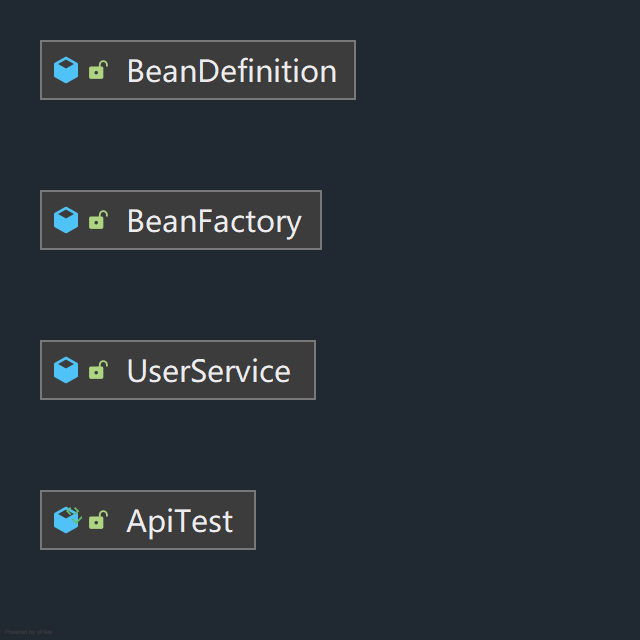
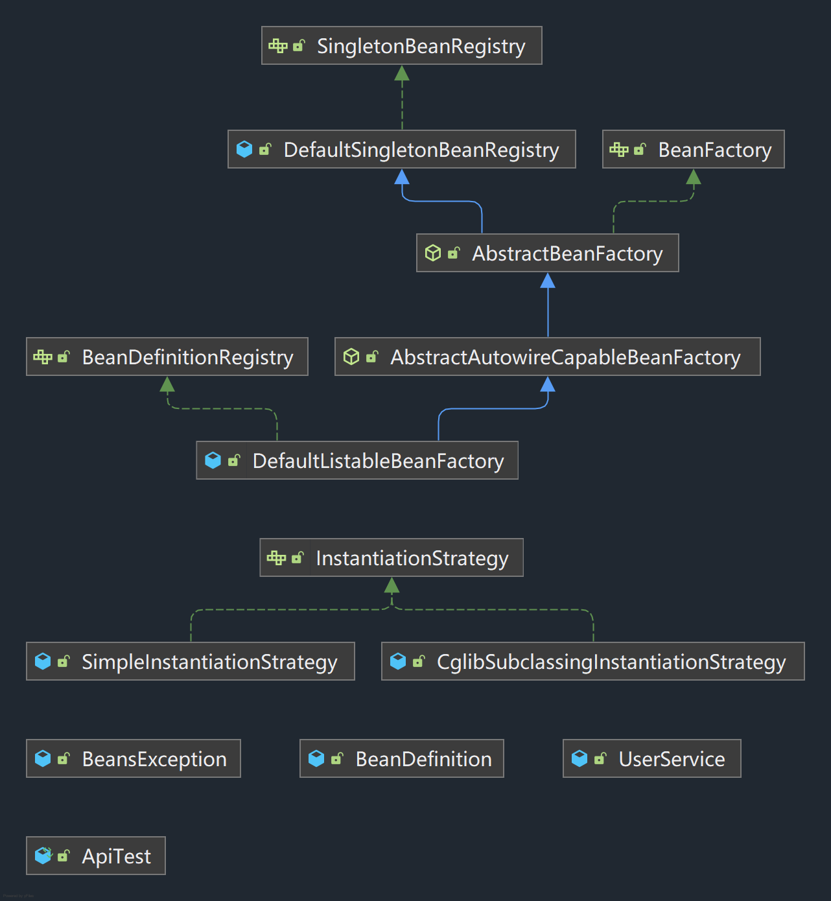
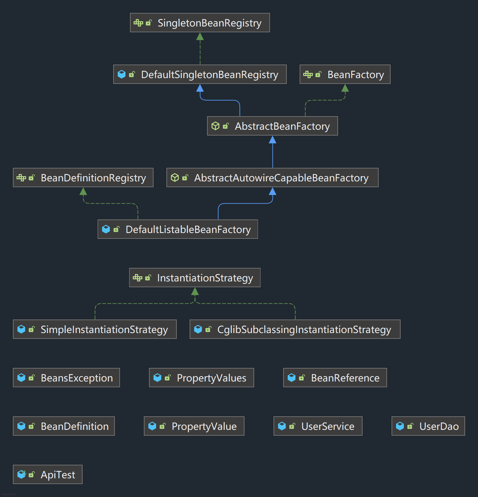
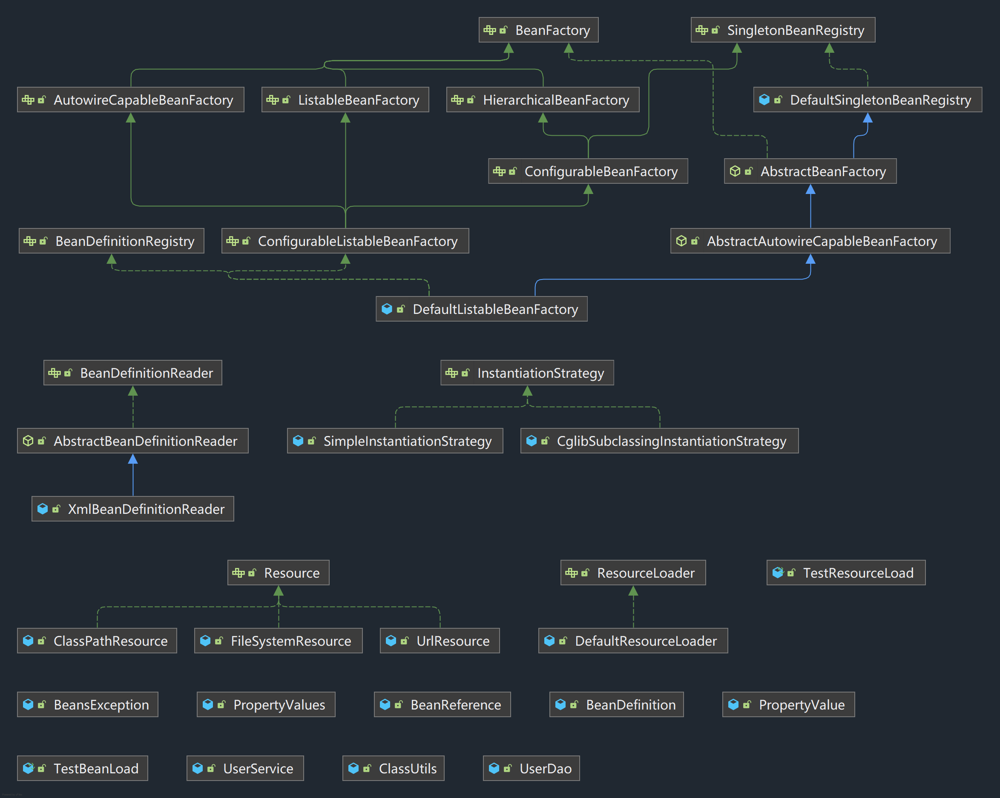
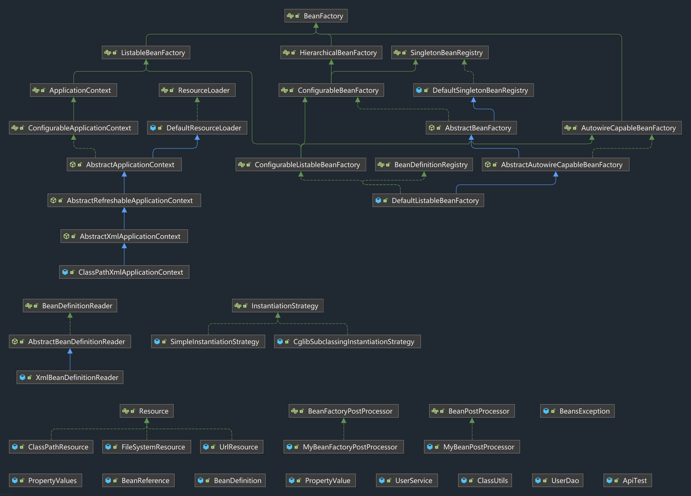
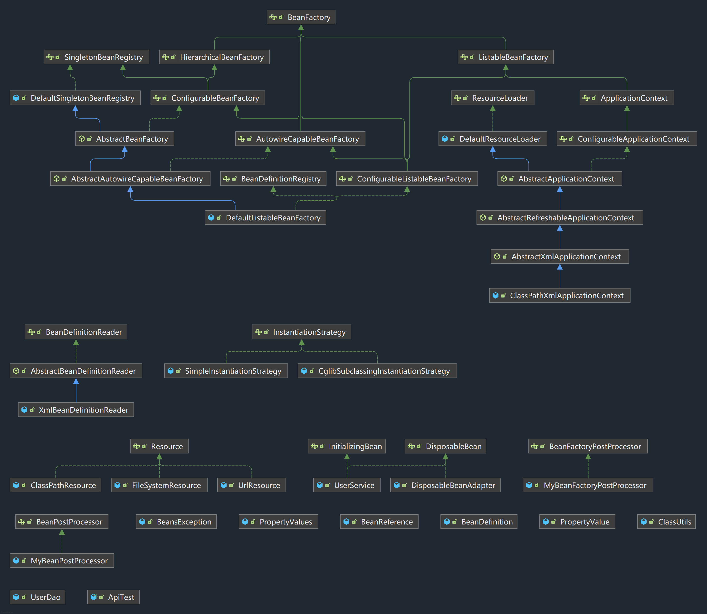
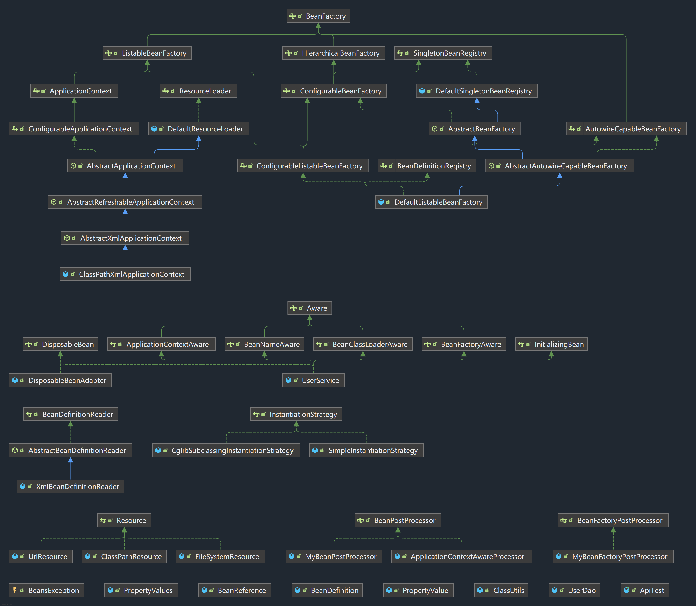
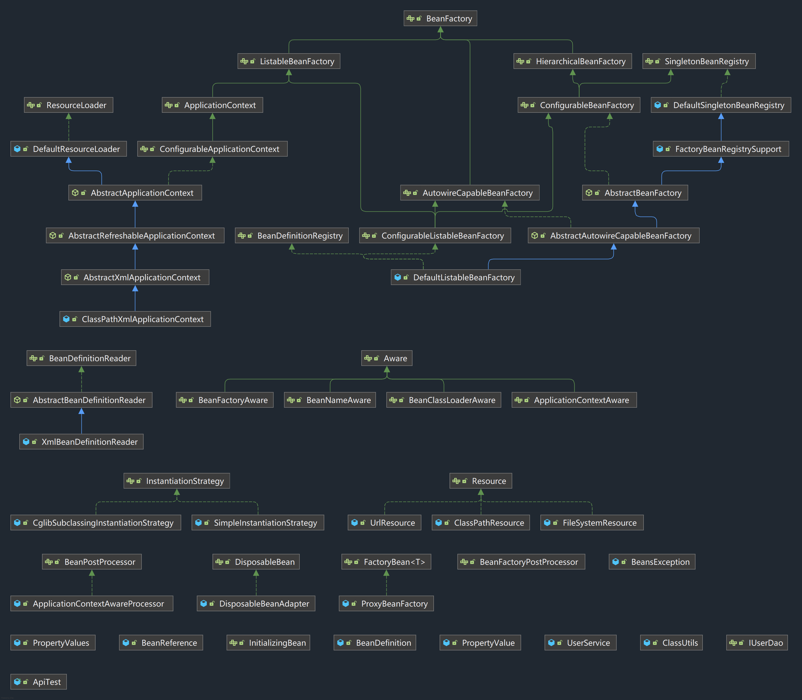

```阅读小傅哥的spring教程的笔记代码```

各个模块的设计目标在各个模块的pom文件中可以找到

---
打断点调试读比较好，spring源码有点复杂，自己模仿写的，也有些类的关系记不清

请使用jdk8运行项目，高版本java会导致cglib报错（java9开始引入module，非法访问lib中的一些module是禁止的）

module：
- 1、可以直接new一个对象放在容器里

- 2、可以将beanDefinition放在容器里，获取的时候再初始化

- 3、可以根据bean的构造函数的参数个性化初始化（之前只能使用默认构造函数）

- 4、可以在注入时对没有被构造的属性进行属性的注入

- 5、可以根据配置文件进行bean定义（之前需要写代码构造）

- 6、可以自定义bean工厂后置处理器和bean前后置处理器

- 7、可以自定义初始化和销毁的钩子函数

- 8、可以让bean感知到自己创建过程中的一些参与者，这在spring当中叫做aware

- 9、可以设置scope，可以与其他框架交接

- 10、可以设置时间监听器，也就是listener